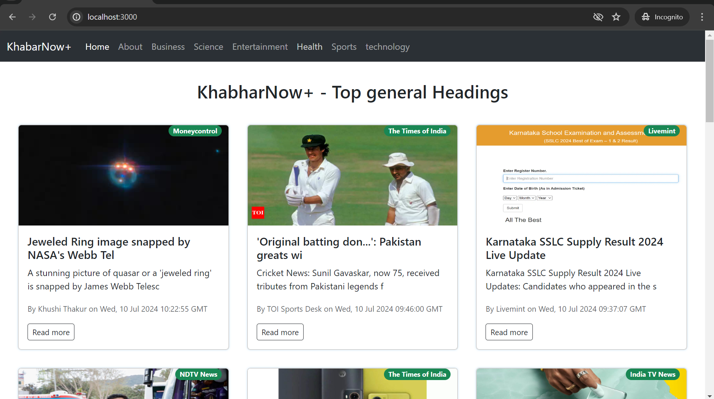

# My Portfolio

Welcome to my portfolio repository! This repository showcases various projects and related assets developed during my journey as a front-end developer and engineering student. The code is available in the master branch.

## Layout

- [About Me](#about-me)
- [Projects](#projects)
  - [EZ Utilities](#ez-utilities)
  - [KhabarNow+](#khabarnow)
  - [MovieHive](#moviehive)
  - [TextSmith](#textsmith)
- [Skills and Tools](#skills-and-tools)
- [Contact](#contact)

## About Me

Hello! I'm Gayatri Kadam, a senior year engineering student at Delhi Technological University, pursuing a Bachelor of Technology in Engineering Physics. I am passionate about front-end development and have a keen interest in UI/UX design. This portfolio showcases some of my projects and the skills I've acquired along the way.

## Projects

### EZ Utilities

EZ Utilities is a versatile Chrome extension offering various tools like a color picker, text utility, YouTube video pause, password generator, and to-do list. This extension aims to provide a comprehensive set of utilities for everyday use.

- **GitHub**: [EZ Utilities](https://github.com/gayatrik26/EZ-Utilities)
- **Live Demo**: [EZ Utilities Live](https://chromewebstore.google.com/detail/ez-utilities/bjdfnnianbafojfjefkffmnabnffibgc?hl=en-GB&authuser=0)

### KhabarNow+

 

KhabarNow+ is an upgraded version of KhabarNow, a real-time news application built with ReactJS. It fetches news data from various categories such as politics, IPL, finance, and more using the News API, providing users with up-to-date information from around the world.

- **GitHub**: [KhabarNow+](https://github.com/gayatrik26/KhabarNow-)

### MovieHive

 

MovieHive is a modern, responsive movie site where users can browse trending movies, explore genres, and view detailed information on their favorite titles. The site offers a user-friendly interface and comprehensive movie details.

- **GitHub**: [MovieHive](https://github.com/gayatrik26/MovieHive)
- **Live Demo**: [MovieHive Live](https://github.com/gayatrik26/MoiveHive-2.0)

### TextSmith 

TextSmith is a utility tool designed to manipulate text. It includes features such as word counting, character counting, lowercase conversion, case inversion, text replication, and text clearing. TextSmith aims to enhance productivity by providing essential text manipulation tools.

- **GitHub**: [TextSmith](https://github.com/gayatrik26/TextSmith)
- **Live Demo**: [TextSmith Live](https://textsmith.netlify.app/)

## Skills and Tools

### Languages
- HTML
- CSS
- JavaScript
- C/C++
- Python
- Matlab

### Tools
- VS Code
- Figma

### Web Development
- React.js
- Three.js
- Material-UI (MUI)
- Bootstrap
- Tailwind CSS

### Version Control
- Git
- GitHub
